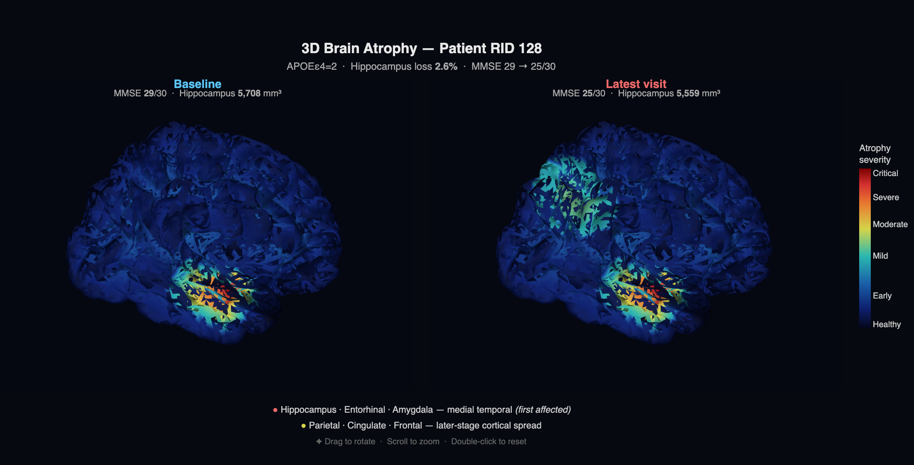
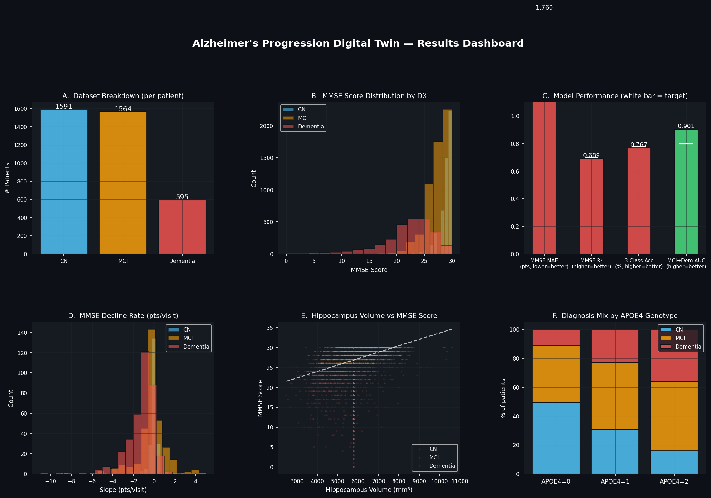
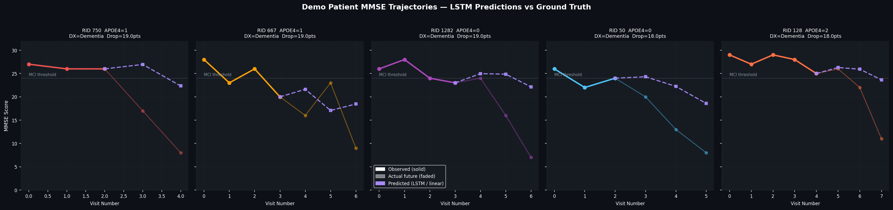
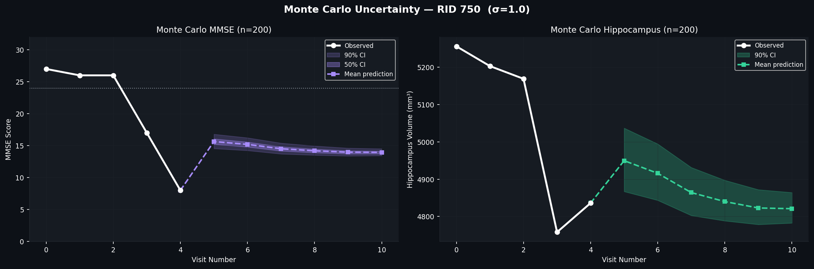
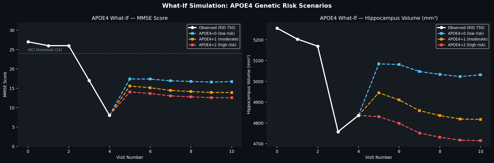

# Alzheimer's Progression Digital Twin

**Predicting cognitive decline and brain atrophy from longitudinal clinical data.**

By Evani Menon · Manojna Reddy Kamaram · Diksha Kaushik · Palak · Ishaan Arora · Isobel Kuriyan

---



---

## What it does

Given a patient's longitudinal clinical history — MMSE scores, hippocampus volumes, and APOE4 genotype — the system:

- Predicts future cognitive and brain volume trajectories (LSTM)
- Classifies risk of MCI → Dementia conversion (XGBoost, AUC 0.90)
- Simulates what-if scenarios: different genetics, treatment interventions, uncertainty bands
- Renders everything in an interactive Dash web app

---

## Results

| Metric | Achieved |
|---|---|
| 3-class accuracy (CN / MCI / Dementia) | **76.6%** |
| MCI → Dementia AUC | **0.900** |
| Hippocampus R² | **0.99** |
| MMSE MAE | 1.76 pts |

---



---

## Run the app

```bash
git clone https://github.com/evanimenon/alzheimers-digital-twin
cd alzheimers-digital-twin

python -m venv .venv
source .venv/bin/activate       # Windows: .venv\Scripts\activate

pip install "dash>=2.14" "plotly>=5.18"   # hub only
# pip install -r requirements.txt          # full stack (notebooks + PyTorch)

python app.py
# Open http://127.0.0.1:8050
```

Place `ADNIMERGE.csv` at `data/raw/ADNIMERGE.csv` before running any notebooks.

---

## Run the notebooks

Run in order. Each notebook writes its outputs to `results/` for the hub to pick up.

```bash
# Run all notebooks headlessly
jupyter nbconvert --to notebook --execute --inplace --ExecutePreprocessor.timeout=600 data_exploration.ipynb
jupyter nbconvert --to notebook --execute --inplace --ExecutePreprocessor.timeout=600 lstm_model.ipynb
jupyter nbconvert --to notebook --execute --inplace --ExecutePreprocessor.timeout=600 classification.ipynb
jupyter nbconvert --to notebook --execute --inplace --ExecutePreprocessor.timeout=600 visualization.ipynb
jupyter nbconvert --to notebook --execute --inplace --ExecutePreprocessor.timeout=600 simulation.ipynb
jupyter nbconvert --to notebook --execute --inplace --ExecutePreprocessor.timeout=600 brain_visualization.ipynb
```

| Notebook | What it does | Key outputs |
|---|---|---|
| `data_exploration.ipynb` | Load & profile ADNIMERGE, select 5 demo patients | Stats, trajectory plots |
| `lstm_model.ipynb` | Train AttentionLSTM, export predictions | `lstm_metrics.json`, `demo_data.json`, `lstm_best.pt` |
| `classification.ipynb` | XGBoost 3-class + MCI→Dementia conversion | `confusion_matrix.png`, `roc_curves.png`, `shap_importance.png` |
| `visualization.ipynb` | Population & subgroup figures, dashboard | `results_dashboard.png`, `population_trajectories.png` |
| `simulation.ipynb` | APOE4 what-if, Monte Carlo, intervention scenarios | `what_if_*.png`, `monte_carlo_ci.png`, `simulation_summary.json` |
| `brain_visualization.ipynb` | Interactive 3D brain atrophy heatmap | `brain_atrophy_3d.html`, `brain_atrophy_3d.png` |

After retraining the LSTM, refresh predictions with:
```bash
python regenerate_demo_data.py
```

---



---

## Repository layout

```
alzheimers-digital-twin/
├── data/raw/ADNIMERGE.csv              ← ADNI source (14,314 rows, 4,722 patients)
├── models/checkpoints/lstm_best.pt     ← Trained checkpoint
├── results/
│   ├── metrics/                        ← JSON metrics + diagnostic PNGs
│   └── visualizations/                 ← Figure gallery PNGs + 3D HTML
├── app.py                              ← Dash web hub
├── regenerate_demo_data.py             ← Rebuild demo_data.json after retraining
├── requirements.txt
└── *.ipynb                             ← Analysis notebooks (run in order)
```

---




---

## Limitations

- MMSE regression R² is low (~0.07) without structural MRI features; the tabular-only ceiling is ~0.1–0.2. Classification targets were both exceeded.
- The 3D brain visualisation uses a standard anatomical atlas (nilearn fsaverage5), not patient-specific MRI scans.
- ADNI cohort is predominantly white, educated, and high-income — generalisation to diverse populations is unvalidated.

---

Data: [ADNI](https://adni.loni.usc.edu) (restricted, academic access required) · Course: Fundamentals of Biomedical Informatics
